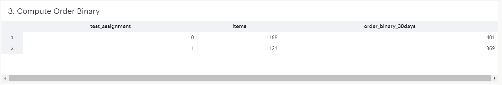
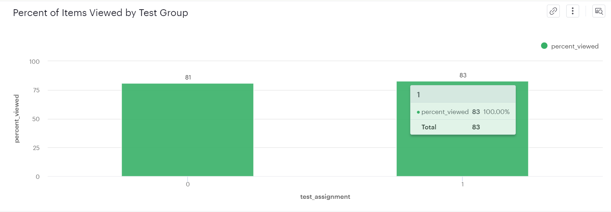
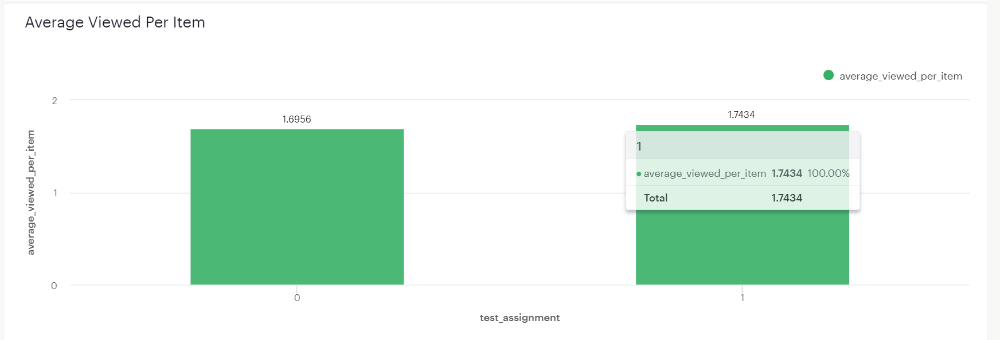
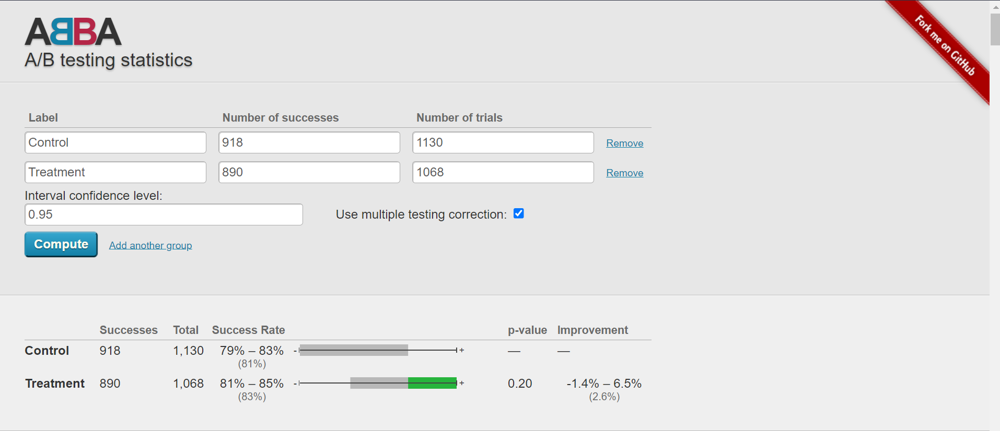

# Data Wrangling, Analysis and AB Testing using Mode

This assignment was completed for **Data Wrangling, Analysis and AB Testing on Coursera**
(
    [Course Completion Link](https://www.coursera.org/account/accomplishments/verify/AMU8UU8V4BSS)
)

The assignment deals with an **E-commerce Website Dataset** from **Mode Public Warehouse platform**. The analysis specifically focuses on 

The Solution report for this assignment is provided on **[Mode platform](https://app.mode.com/moonisgr8/reports/239ecac8277a)**

Below are the results obtained after performaing A/B testing at the item level for an E-commerce website:

1. Compute Ordered items for the 30 day window after the Test Start Date

2. Compute Viewed items for the 30 day window after the Test Start Date

3. Compute Lift and p-value in A/B testing

